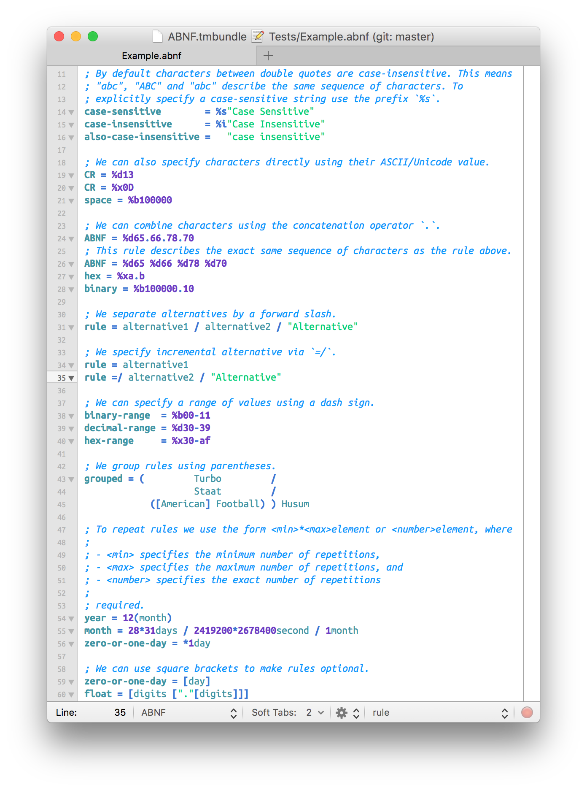
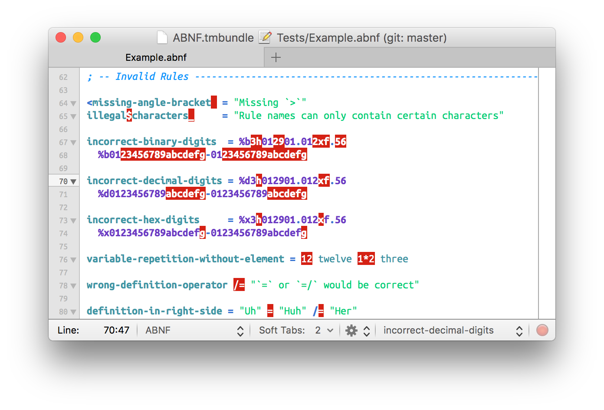
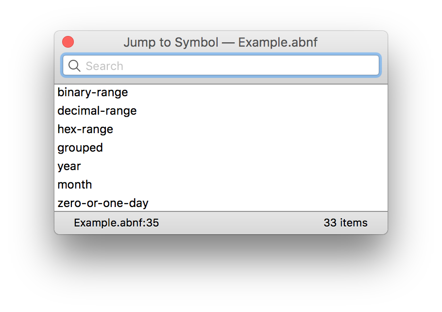
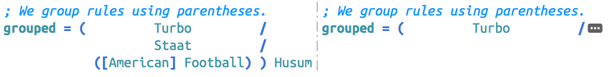

# ABNF Bundle

This [TextMate][] bundle adds support for [Augmented Backus–Naur Form][], a meta-language used to write  context free grammars.

[TextMate]: https://github.com/textmate/textmate
[Augmented Backus–Naur Form]: https://en.wikipedia.org/wiki/Augmented_Backus–Naur_Form

# Features

## Syntax Highlighting

The screenshot below shows syntax highlighting for correct ABNF code using the [Rainbow Dash][] theme .

[Rainbow Dash]: http://github.com/sanssecours/Rainbow-Dash.tmbundle



The included ABNF grammar also catches common mistakes:



## Symbol List

To quickly jump to rule definitions use <kbd>⌘</kbd>+<kbd>⇧</kbd>+<kbd>T</kbd>:



## Code Folding

Use code folding to temporarily hide the content of long rules:



# Installation

## Manual

1. Download the latest [release][]
2. Unzip the archive
3. Double-Click on “ABNF.tmbundle”

[release]: http://github.com/sanssecours/ABNF.tmbundle/releases

## Terminal

```sh
mkdir -p "$HOME/Library/Application Support/TextMate/Bundles"
cd "$HOME/Library/Application Support/TextMate/Bundles"
git clone https://github.com/sanssecours/ABNF.tmbundle
```
